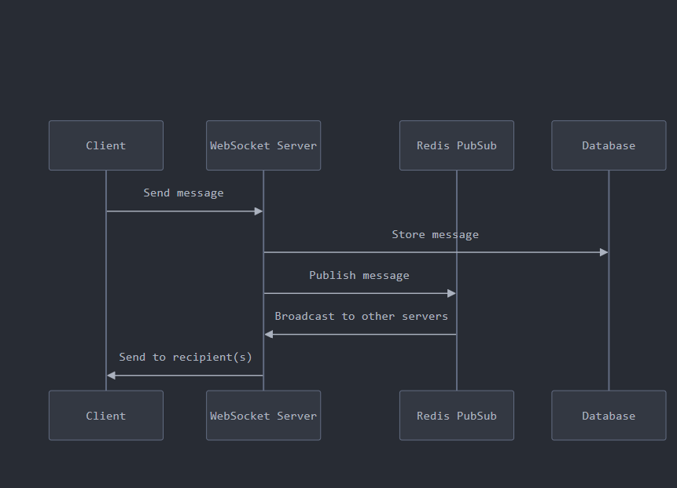
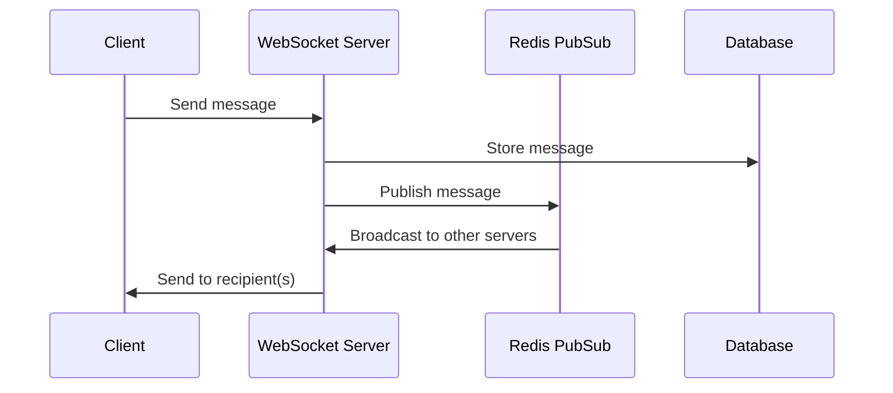

# Chat App Architecture with Redis for Horizontal Scaling

1. **Real-time messaging with WebSockets**
   - Use WebSocket connections for instant message delivery
   - Implement a WebSocket server (e.g., Socket.io, ws)

2. **User authentication**
   - Secure login/registration system
   - Password hashing and JWT for session management

3. **Message persistence**
   - Database schema for storing messages and conversations
   - API endpoints for message CRUD operations

4. **Group chat functionality**
   - Backend logic for creating, joining, and managing group chats

5. **Message search**
   - Implement search functionality for messages and conversations

6. **API rate limiting**
   - Add rate limiting to API endpoints to prevent abuse

7. **Redis integration for horizontal scaling**
   - Use Redis as a pub/sub mechanism for distributing messages across multiple server instances
   - Implement caching layer with Redis for frequently accessed data (e.g., user profiles, recent messages)
   - Session storage in Redis for faster access and easy scaling

8. **Load balancing**
   - Implement a load balancer (e.g., NGINX) to distribute traffic across multiple server instances

9. **Microservices architecture**
   - Break down the application into smaller, independently deployable services (e.g., auth service, messaging service, user service)
   - Use Redis as a message broker between microservices

10. **Monitoring and logging**
    - Implement centralized logging (e.g., ELK stack)
    - Set up monitoring for Redis and other critical services


# Microservices Interaction in Chat Application

## Communication Patterns

1. **Synchronous Communication (HTTP/REST)**
   - Direct service-to-service calls using HTTP/REST APIs
   - Suitable for request-response patterns
   - Example: User Service calling Auth Service to validate a token

2. **Asynchronous Communication (Message Queue)**
   - Services communicate through a message broker (e.g., Redis, RabbitMQ, Apache Kafka)
   - Suitable for event-driven architecture
   - Example: Messaging Service publishing a new message event

3. **Service Discovery**
   - Implement service registry (e.g., Consul, Etcd)
   - Services register themselves and discover others dynamically

4. **API Gateway**
   - Single entry point for all client requests
   - Routes requests to appropriate microservices
   - Handles cross-cutting concerns (authentication, logging)

## Example Interactions

1. **User Authentication Flow**
   - Client -> API Gateway -> Auth Service
   - Auth Service -> User Service (validate user)
   - Auth Service -> Redis (store session)

2. **Sending a Message Flow**
   - Client -> API Gateway -> Messaging Service
   - Messaging Service -> User Service (check permissions)
   - Messaging Service -> Database (persist message)
   - Messaging Service -> Redis (publish message event)
   - Notification Service <- Redis (consume message event)
   - Notification Service -> Push Notification Provider

3. **Updating User Profile Flow**
   - Client -> API Gateway -> User Service
   - User Service -> Database (update profile)
   - User Service -> Redis (publish profile update event)
   - Chat Service <- Redis (consume profile update event)
   - Chat Service -> WebSocket (broadcast profile update)

## Implementation Considerations

- Use consistent data formats (e.g., JSON) for inter-service communication
- Implement circuit breakers for fault tolerance
- Consider using gRPC for efficient internal communication
- Implement distributed tracing for debugging and performance monitoring
- Use event sourcing and CQRS patterns for complex data flows

# WebSocket Authentication in Chat Application

## Initial Connection Authentication

1. **Token-based Authentication**
   - Client includes a JWT in the WebSocket connection request
   - Server validates the token before establishing the connection

2. **Connection Establishment Process**
   - Client initiates WebSocket connection with token in query parameter or header
   - Server extracts and validates token
   - If valid, connection is established; if invalid, connection is rejected

3. **Example Connection URL**
   ```
   ws://chat.example.com/socket?token=eyJhbGciOiJIUzI1NiIsInR5cCI6IkpXVCJ9...
   ```

## Maintaining Authentication State

1. **In-Memory Store**
   - Store authenticated socket connections in a map: `socketId -> userId`
   - Use Redis for distributed environments

2. **Periodic Token Refresh**
   - Implement token refresh mechanism to maintain long-lived connections
   - Client sends refresh requests over the WebSocket connection

## Message Authentication

1. **Message Structure**
   ```json
   {
     "type": "message",
     "content": "Hello, world!",
     "token": "eyJhbGciOiJIUzI1NiIsInR5cCI6IkpXVCJ9..."
   }
   ```

2. **Server-side Validation**
   - Extract token from each incoming message
   - Validate token before processing the message
   - Reject messages with invalid or expired tokens

## Implementation Considerations

1. **Security**
   - Use WSS (WebSocket Secure) to encrypt all WebSocket traffic
   - Implement rate limiting to prevent abuse
   - Set short expiration times for tokens

2. **Performance**
   - Cache validated tokens to reduce database lookups
   - Use lightweight JWT validation for frequent message authentication

3. **User Experience**
   - Implement graceful reconnection with authentication on connection loss
   - Provide clear feedback to users on authentication failures

4. **Scalability**
   - Use Redis to share authentication state across multiple server instances
   - Implement a WebSocket gateway for load balancing authenticated connections
  

  # Secure WebSocket Authentication Methods

## 1. Custom Headers (Recommended)

- Use custom headers for initial WebSocket handshake
- More secure than query parameters
- Not visible in server logs

```javascript
const socket = new WebSocket('wss://chat.example.com/socket');
socket.setRequestHeader('Authorization', 'Bearer ' + token);
```

## 2. Cookies

- Set HTTP-only, secure cookies
- Automatically included in WebSocket handshake
- Requires proper CORS configuration

```javascript
// Set cookie on server
res.cookie('auth_token', token, { httpOnly: true, secure: true, sameSite: 'strict' });

// Client-side connection
const socket = new WebSocket('wss://chat.example.com/socket');
```

## 3. Initial HTTP Request + WebSocket Upgrade

- Authenticate via HTTP POST
- Upgrade to WebSocket with session ID
- Provides additional layer of security

```javascript
// Client-side
async function connectWebSocket() {
  const response = await fetch('https://chat.example.com/auth', {
    method: 'POST',
    body: JSON.stringify({ username, password }),
    headers: { 'Content-Type': 'application/json' }
  });
  const { sessionId } = await response.json();
  const socket = new WebSocket(`wss://chat.example.com/socket?session=${sessionId}`);
}
```

## 4. Post-connection Authentication

- Establish unauthenticated WebSocket first
- Send authentication message immediately after connection
- Requires careful handling of pre-auth messages

```javascript
const socket = new WebSocket('wss://chat.example.com/socket');
socket.onopen = () => {
  socket.send(JSON.stringify({ type: 'auth', token: 'your-auth-token' }));
};
```

## Security Considerations

- Always use WSS (WebSocket Secure) to encrypt all traffic
- Implement token expiration and refresh mechanisms
- Use strong, httpOnly, secure cookies if using cookie-based auth
- Validate origin of WebSocket connections
- Implement rate limiting and connection throttling

## Server-side Implementation (Node.js + ws example)

```javascript
const WebSocket = require('ws');
const http = require('http');
const jwt = require('jsonwebtoken');

const server = http.createServer();
const wss = new WebSocket.Server({ noServer: true });

server.on('upgrade', function upgrade(request, socket, head) {
  // Extract token from custom header
  const token = request.headers['sec-websocket-protocol'];

  jwt.verify(token, 'your-secret-key', (err, decoded) => {
    if (err) {
      socket.write('HTTP/1.1 401 Unauthorized\r\n\r\n');
      socket.destroy();
      return;
    }

    wss.handleUpgrade(request, socket, head, function done(ws) {
      wss.emit('connection', ws, request, decoded.userId);
    });
  });
});

wss.on('connection', function connection(ws, request, userId) {
  // Handle authenticated connection
});

server.listen(8080);
```


- Databse persistance

- Write queries to fetch Messages by taking from and to as Input 
- if the sent client is not found then just Insert it into the Database What is the Order of the Operations That needs to be performed Should it be first updated in the DAtabse or should it be sent to the socket 

- SQl queries Needed
- to insert into Conversations Table 
- to fetch the conversations 



For designing a WebSocket chat app with persistent storage, you have a few key considerations to balance. Let's break this down and discuss the best approach:

1. Order of operations:
   - Store in DB first vs. Send via WebSocket first

2. Integrating Redis as a pub/sub mechanism

Here's a recommended approach:




1. Order of operations:
   It's generally better to store in the database first, then send via WebSocket. Here's why:

   - Data integrity: By storing first, you ensure the message is persisted even if there's a problem with the WebSocket connection.
   - Consistency: The database becomes the single source of truth.
   - Message ID: You can generate a unique ID when storing, which can be useful for tracking and ordering messages.

2. Integrating Redis as a pub/sub mechanism:
   Redis pub/sub is excellent for distributing messages across multiple WebSocket servers, enabling horizontal scaling. Here's how to integrate it:

   - After storing in the database, publish the message to a Redis channel.
   - Have your WebSocket servers subscribe to this Redis channel.
   - When a message is published, broadcast it to the appropriate connected clients.

Here's a basic code structure to implement this approach:


```javascript
const WebSocket = require('ws');
const Redis = require('ioredis');
const { saveMessageToDB } = require('./database');

const wss = new WebSocket.Server({ port: 8080 });
const redis = new Redis();
const pubClient = new Redis();

wss.on('connection', (ws) => {
  ws.on('message', async (message) => {
    try {
      // 1. Store message in database
      const savedMessage = await saveMessageToDB(message);

      // 2. Publish message to Redis
      await pubClient.publish('chat_messages', JSON.stringify(savedMessage));

      // 3. Send acknowledgement to sender
      ws.send(JSON.stringify({ status: 'sent', id: savedMessage.id }));
    } catch (error) {
      console.error('Error processing message:', error);
      ws.send(JSON.stringify({ status: 'error', message: 'Failed to process message' }));
    }
  });
});

// Subscribe to Redis channel
redis.subscribe('chat_messages', (err, count) => {
  if (err) {
    console.error('Failed to subscribe: %s', err.message);
  } else {
    console.log(`Subscribed successfully! This client is currently subscribed to ${count} channels.`);
  }
});

redis.on('message', (channel, message) => {
  const parsedMessage = JSON.parse(message);
  
  // Broadcast message to all connected clients
  wss.clients.forEach((client) => {
    if (client.readyState === WebSocket.OPEN) {
      client.send(JSON.stringify(parsedMessage));
    }
  });
});

```

This structure provides several benefits:

1. Messages are stored in the database first, ensuring data persistence.
2. Redis pub/sub allows for easy scaling across multiple WebSocket servers.
3. The sender gets an acknowledgement once the message is stored and published.
4. All connected clients receive new messages via the Redis subscription.

To further improve this system, consider:

1. Implementing authentication and user sessions.
2. Adding error handling and retries for database and Redis operations.
3. Implementing message delivery confirmations from recipients.
4. Using a message queue for additional reliability in high-load scenarios.

Would you like me to elaborate on any part of this architecture or implementation?